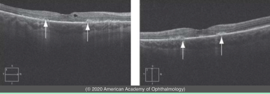
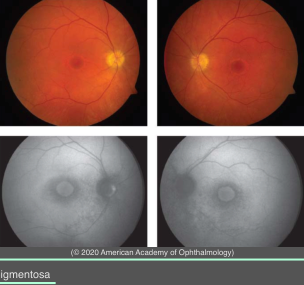

# Systemic Drug-Induced Retinal Toxicity I: Chloroquine derivatives

## Images

## Hierarchy

- drugs
  - chloroquine
  - hydroxychloroquine
    - much safer
  - for treatment of malaria and rheumatologic and dermatologic disorders
  - bind to melanin in RPE
- symptoms
  - reading difficulty
  - central visual decline
  - paracentral scotomas
- Risk factors
  - daily dose
    - low-risk
      - hydroxychloroquine
        - daily dose <6.5 mg/kg ideal body weight
          - daily dose of ≤5.0 mg/kg based on the patient’s real body weight may be safer
      - chloroquine
        - daily dose <3 mg/kg ideal body weight
          - daily dose of ≤2.3 mg/kg based on the patient’s real body weight may be safer
        - <460 g cumulative dose
      - Cumulative total doses greater than 1000 g of hydroxychloroquine and 460 g of chloroquine place patients at high risk of toxicity
  - duration of use
    - incidence of toxicity
      - .< 5 years
        - .<1%
          - rare cases of toxicity have occurred with “safe” daily doses & in the absence of other risk factors
      - .<10 years
        - .<2%
      - .>20 years
        - 20%
    - high-risk cumulative total doses
      - .> 460 g chloroquine
      - .> 1000 g hydroxychloroquine
  - additional risk factors
    - obesity
      - safe daily doses are based on lean body weight
    - kidney disease
    - concomitant use of tamoxifen (5-fold increase)
    - liver disease
    - older age (>60 years)
    - concomitant retinal disease
      - AMD
    - start annual examinations with initiation of drug use
- clinical signs
  - earliest signs of toxicity
    - bilateral paracentral scotoma
      - most patients of Asian descent show initial damage in a more peripheral extramacular distribution
    - paracentral inner segment ellipsoid loss
      - “flying saucer” sign on SD-OCT
  - progressive pigmentary changes
    - subtle granular depigmentation of paracentral RPE
    - atrophic bull's-eye maculopathy
    - end-stage cases simulate retinitis pigmentosa
  - corneal verticillata
- screening
  - baseline examination
    - complete eye exam
    - within the first year of use
  - follow-up examination
    - annual screening after 5 years of use in patients at low risk for toxicity
      - many practitioners screen patients every 6-12 months for the first 5 years and then every 6 months
    - SD-OCT
    - automated threshold field testing
      - central 10o with white test target
      - scotomata
        - precede symptomatic visual loss
          - Humphrey 10-2 program
        - precede fundus changes
        - reversible
  - patients at risk or with unclear symptomatology
    - fundus autofluorescence
      - paracentral ring of hyperautofluorescence or hypoautofluorescence
    - multifocal ERG
      - paracentral mfERG depressions
- treatment
  - cessation of drug at first sign of toxicity
    - visual loss rarely recovers and may even progress
