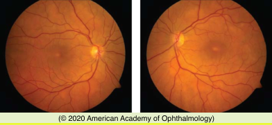
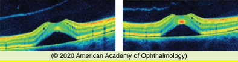
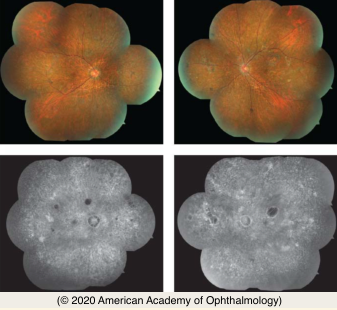
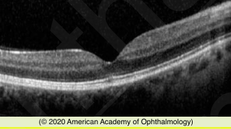

# Systemic Drug-Induced Retinal Toxicity II

## Images

## Hierarchy

- Phenothiazines
  - concentrated in uveal tissue and RPE by binding to melanin granules
  - High-dose chlorpromazine
    - abnormal pigmentation of
      - eyelids
      - interpalpebral conjunctiva
      - cornea
      - anterior lens capsule
    - anterior and posterior subcapsular cataracts
    - pigmentary retinopathy is unusual
  - High-dose thioridazine
    - severe pigmentary retinopathy
      - within a few weeks-months of initiation
      - rare at doses ≤800 mg/day
      - early
        - blurred vision
        - RPE stippling in the posterior pole
      - late
        - visual field loss
          - may be mistaken for choroideremia or Bietti crystalline dystrophy
        - nyctalopia
        - patchy nummular atrophy of the RPE and choriocapillaris
  - Screening
    - toxicity is rare at standard doses
    - patients taking thioridazine are not monitored
    - symptomatic patients should undergo a full retinal evaluation
      - especially those who have taken high doses of the drug
- Miscellaneous Medications causing RPE/Photoreceptor Complex toxicity
  - Clofazimine
    - phenazine dye
      - dapsone-resistant leprosy
      - autoimmune disorders
        - systemic lupus erythematosus
        - psoriasis
    - bull’s-eye maculopathy
  - Deferoxamine
    - iron-chelating agent
    - reticular or vitelliform macular RPE changes
    - macular edema caused by RPE pump failure
  - dideoxyinosine
    - nucleoside reverse transcriptase inhibitors (NRTIs)
      - inhibits replication of HIV virus
    - mitochondrial toxicity
      - damage to tissues with high oxygen requirements
        - optic nerve
        - RPE
    - midperipheral concentric mottling and atrophy of RPE and choriocapillaris
    - peripheral vision loss
    - fundus autofluorescence
  - MEK inhibitors
    - chemotherapeutic agent
      - treatment of metastatic cancers
      - condition similar to CSCR
        - multifocal serous retinal detachments
  - sildenafil
    - serous macular detachment and central serous chorioretinopathy
    - choroidal vascular dilation and choroidal congestion
      - increased choroidal thickness on (EDI) SD-OCT
  - Corticosteroids
    - most common medications to be associated with the development of CSCR
  - alkyl nitrites (“poppers”)
    - inhaled to induce euphoria and relax smooth muscles,
      - usually in preparation for sexual activity
    - toxic maculopathy
      - rare
      - young patient
      - central scotoma or photopsia
      - yellow spot on the fovea
      - SD-OCT
        - focal disruption of central inner segment ellipsoid band
