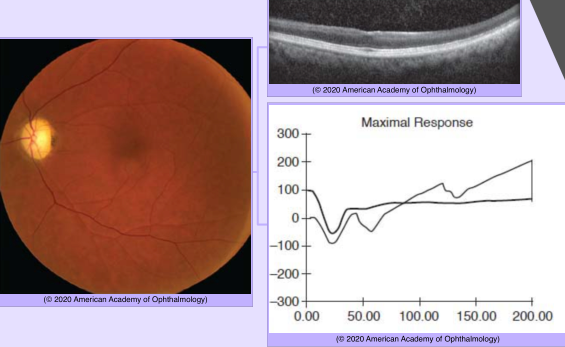

# Systemic Drug-Induced Retinal Toxicity III

## Images

## Hierarchy

- Drugs Causing Abnormalities in Color Vision and Electroretinography
  - Phosphodiesterase 5 (PDE-5) inhibitors
    - drugs
      - sildenafil
      - tadalafil
    - partially inhibit phosphodiesterase 6 (PDE-6)
      - enzyme in phototransduction cascade
        - in ≤ 50% of patients ingesting doses >100 mg
    - transient blue tinting of vision
    - temporary abnormal ERG responses (including a delayed cone b-wave implicit time)
    - no permanent retinal toxic effects
  - digitalis
    - cardiac glycoside
    - yellow tinting of vision (xanthopsia)
      - reversible
  - isotretinoin
    - poor night vision
    - abnormal dark-adaptation curves and ERG responses
    - more likely in patients undergoing repetitive therapy courses for acne
    - reversible
  - vigabatrin
    - antiepileptic drug
    - depression of the 30-Hz cone amplitude
- Drugs Causing Occlusive Retinopathy or Microvasculopathy
  - Interferon alfa-2a
    - antiviral & immunomodulatory
      - treatment of viral hepatitis
    - paracentral visual field defects
    - cotton-wool spots and retinal hemorrhages
  - Ergot alkaloids
    - vasoconstrictors used to treat migraines
    - thrombotic complications (retinal vein and artery occlusions)
  - oral contraceptives
    - thrombotic complications (retinal vein and artery occlusions)
  - Procainamide
    - causes systemic lupus erythematosus
    - extensive “pruning” of second-order retinal vessels
  - Gentamicin (& amikacin)
    - intraocularly but not systemically
    - severe macular ischemia (infarction)
  - hemorrhagic occlusive retinal vasculitis (HORV)
  - Vancomycin
    - intracameral
      - for prophylaxis of endophthalmitis
    - widespread retinal vascular occlusion
    - type III hypersensitivity reaction
      - antibody/antigen complex deposition
        - small vessel vasculitis
- Miscellaneous
  - sulfur-derived medications
    - topiramate
    - acetazolamide
    - myopia
    - retinal and choroidal folds
    - macular edema
    - vision loss
      - mild
        - caused by isolated macular folds
      - severe
        - caused by ciliochoroidal effusion, leading to angle-closure glaucoma
    - reversed with prompt discontinuation of the drug
  - rifabutin
    - for Mycobacterium avium-complex infection prophylaxis in HIV-positive patients
    - anterior & posterior uveitis
      - ± hypopyon
      - reversible
      - hypotony
    - stellate, refractile endothelial deposits
      - initially in the periphery; may extend to the central cornea
  - buproprion
    - choroidal effusion
  - silver
    - erroneously claimed to have medicinal benefits
      - overingestion
    - argyria
      - slate-gray or blue coloring of the skin
    - ocular argyrosis
      - after colloidal silver ingestion over > 1 year
      - ocular pigmentation
      - dark choroid
        - brown-black granules diffusely deposited in Bruch membrane
          - “leopard spotting”
          - drusenlike deposition
      - black tears
- Drugs Causing Ganglion Cell & Optic Nerve Toxicity
  - Quinine
    - muscle relaxant for leg cramps and antimalarial
    - dose
      - safe at doses < 2 g
      - morbidity at doses > 4 g
      - mortality at doses > 8 g
    - retinal ganglion cell toxicity
      - acute severe vision loss
        - permanent
      - mimicks CRAO
        - early
          - cherry-red spot
          - OCT
            - ganglion cell layer thickening and hyperreflectivity
        - late
          - diffuse inner-retinal atrophy
          - optic atrophy
          - retinal vascular attenuation
        - full-field ERG
          - negative waveform signal
            - similar to CRAO
  - Methanol
    - acute blindness
    - early
      - acute transient optic nerve head and macular edema
      - retina, RPE, and optic nerve demonstrate vacuolization
        - sign of cell death
    - late
      - optic atrophy
        - most common sequela
      - retinal vascular attenuation
      - diffuse ganglion cell loss
    - full-field ERG
      - electronegative waveform
- Drugs Causing Macular Edema
  - taxanes
    - drugs
      - paclitaxel
      - docetaxel
        - microtubule inhibitors
          - treatment of various cancers
    - cystoid macular edema (CME)
      - rare
      - angiographically silent
  - nicotinic acid
    - angiographically silent CME
    - full recovery follows discontinuation of the drug
  - glitazones
    - drugs
      - rosiglitazone
      - pioglitazone
    - severe fluid retention
      - pulmonary edema
        - oral hypoglycemics
    - development or exacerbation of macular edema
  - Fingolimod
    - oral agent for relapsing multiple sclerosis
    - macular edema
      - usually within 3 months
      - resolves with cessation
  - Topical prostaglandin F2α analogs
    - drugs
      - latanoprost
      - tafluprost
      - bimatoprost
    - can cause macular edema
  - Deferoxamine
    - secondary macular edema caused by RPE toxicity
