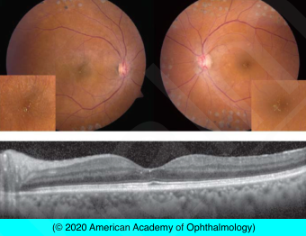
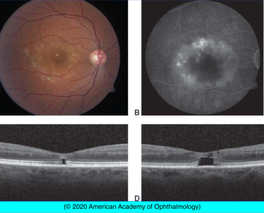

# Systemic Drug-Induced Retinal Toxicity IV: Crystalline Retinopathy

## Images

## Hierarchy

- Systemic diseases
  - Primary hereditary hyperoxaluria
  - Cystinosis
  - Secondary oxalosis
    - chronic renal failure
    - hemodialysis
  - Sjogren-Larsson syndrome
- Canthaxantine
  - carotenoid to stimulate tanning
  - crystalline maculopathy
    - after high dose therapy
    - asymptomatic
    - inner-retinal, glistening deposits
      - doughnut pattern around macula
        - predilection for juxtapapillary region
    - crystals resolve when drug stopped
- Ocular diseases
  - Bietti crystalline dystrophy
  - Calcific drusen
  - Gyrate atrophy
  - Retinal telangiectasia
- Talc
  - injected along with drugs such as methylphenidate
    - long-term intravenous drug abusers
  - deposits
    - intravascular
      - embolize smaller-caliber perifoveal retinal arterioles
        - do not typically cause vision loss
    - refractile
    - peripheral retinal neovascularization
      - rare
- Ethylene glycol
- methoxyflurane anesthesia with renal dysfunction
  - intravascular crystalline deposits of oxalate
- Tamoxifen
  - antiestrogen agent
    - adjuvant therapy for breast cancer
  - crystalline maculopathy
    - high dose therapy
      - rare at standard doses
        - 20 mg/day
      - .>200 mg/day
      - .>100 g
    - brilliant inner-retinal crystalline deposits
      - clustered around the fovea
    - ± CME
    - significant vision loss in severe cases
    - ± irreversible
    - rarely SD-OCT shows central loss of ellipsoid band after low-dose tamoxifen therapy, without visible crystals
- West African crystalline maculopathy
  - elderly persons from Igbo tribe of Nigeria
    - typically diabetic
    - other countries in that region
  - inner-retinal refractile crystals of the fovea
    - yellow-green in color
    - no vision loss
  - long-term ingestion of kola nuts
- Nitrofurantoin
