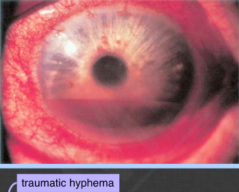

# Traumatic Hyphema

## Images

## Hierarchy

- Assessment
  - traumatic hyphema
- Case Description
  - 15-year-old male was struck in the eye with a paint ball
  - Image Description
    - anterior segment photo shows hyphema
- Differential Diagnosis
  - traumatic hyphema
  - recent ocular surgery
  - iris neovascularization
    - diabetes
  - iris microhemangiomatosis
  - iris tumors (melanoma)
  - Fuchs heterochromic iridocyclitis
- Treatment
  - Medical
    - bed rest
      - or limited activity
    - elevate head of bed
    - eye shield
      - avoid eye patch
    - cycloplegia
    - topical steroid
      - indications
        - deep pain
        - photophobia
        - ciliary flush
        - protein in AC
        - WBC in AC
        - lens capsular rupture
      - taper quickly
    - tylenol for pain
      - avoid sedatives/narcotics
        - do not abruptly stop ASA without consulting patient's PCP
      - avoid aspirin/NSAID
    - glaucoma medication
      - no SS
        - if IOP>30 mm Hg
          - start with beta-blockers
          - add
            - topical CAI
            - alpha-agonists
              - not < age 2 years
                - oral acetazolamide
                - IV mannitol
      - SS
        - if IOP>24 mm Hg
          - only beta blockers are safe
          - avoid systemic diuretics
            - methazolamide safer than acetazolamide
      - avoid CAI if
        - african-american
        - mediterranean
          - SS disease
        - sulfa allergy
      - do not use
        - PG analogs
        - miotics
          - increase inflammation
  - Surgical
    - AC washout
      - total hyphema with IOP≥25 x ≥5 days
        - corneal blood staining
          - avoid miotics for angle recession glaucoma
            - decrease uveoscleral outflow
      - IOP>60 x ≥48 hours
        - uncontrolled high IOP
          - optic nerve damage
      - SS disease with IOP≥24 x ≥ 24 hours or ≥30
        - risk of PAS
      - .>50% hyphema by day 8
      - children at risk of amblyopia
  - indications for hospitalization
    - child abuse
    - children <7-10 years
    - non-compliant patient
    - SS disease
    - bleeding tendency
    - severe high IOP
    - severe orbital/ocular injury
- Data acquistion
  - History
    - medical history
      - sickle cell disease
      - bleeding tendency
      - diabetes
      - medication use
        - ASA
        - NSAID
        - warfarin
    - trauma
      - time of onset of visual loss relative to trauma
      - mechanism
        - type of object
        - force/velocity
      - protective eyewear
  - Physical Exam
    - BCVA
    - APD
      - r/o traumatic optic neuropathy
        - if intact globe
    - IOP
    - ocular motility
    - orbital palpation
      - orbital fracture
    - signs of ruptured globe
    - measure hyphema height
      - unless intractable high IOP
    - avoid gonioscopy
    - dilated fundus exam
      - open globe/globe rupture
      - IOFB
      - retinal tear/dialysis
      - vitreous base avulsion
      - commotio
      - retinal hemorrhage
      - vitreous hemorrhage
      - RD
- Patient Education
  - General
    - explain eyedrop regimen
  - Dos
    - bed rest
    - eye protection
  - Don’ts
    - avoid strenuous activity x ≥1 week
  - Prognosis & Complications
    - rebleeding
    - glaucoma
    - amblyopia in children
    - corneal blood staining
    - RD
  - Follow-up
    - daily x 5 days
      - return immediately if
        - decreased vision
        - increased eye pain
    - 4-week fu
      - gonioscopy
      - scleral depression
    - annual exam for angle recession glaucoma
- Additional Testing
  - B-scan
    - avoid scleral depression
    - if poor fundus view with intact globe
  - CT scan
    - indications
      - orbital fracture
      - IOFB
      - loss of consciousness
    - 1-mm sections
  - ± UBM
  - screen for SS disease/trait
    - Sickledex screen
