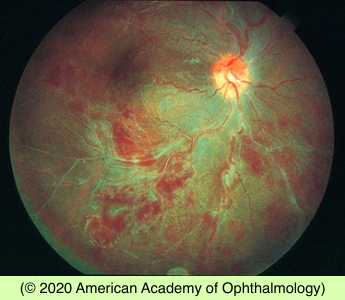

# Vasculitis

## Images

## Hierarchy

- Eales disease
  - primary occlusive retinal vasculopathy for which no cause can be found
  - males
  - tuberculin hypersensitivity
  - usually involves the peripheral retina of both eyes
  - extraretinal neovascularization
  - vitreous hemorrhage
- etiology
  - systemic diseases
    - associated with inflammatory disease elsewhere in the body
  - • giant cell arteritis
  - • polyarteritis nodosa
  - • systemic lupus erythematosus
  - • Behçet disease
  - • inflammatory bowel disease
  - • multiple sclerosis
  - • pars planitis
  - • sarcoidosis
  - • syphilis
  - • toxoplasmosis
  - • viral retinitides
  - • Lyme disease
  - • cat-scratch disease
  - • certain medications, such as rifabutin
- Susac syndrome
  - no known cause
  - women in their third decade
  - clinical findings
    - multiple branch retinal arterial occlusions
    - hearing loss
    - strokes
      - rare
  - treatment
    - corticosteroids
    - immunosuppression
- chronic embolism/thrombosis
  - clinical picture indistinguishable from past retinal vasculitis may result from chronic embolism or thrombosis without inflammation
  - etiology
    - cardiac valvular disease
    - cardiac arrhythmias
    - ulcerated atheromatous disease of the carotid vessels
    - hemoglobinopathies
- early clinical manifestations
  - perivascular infiltrates
  - sheathing of the retinal vessels
  - combination of both arterial and venous involvement is the rule
    - veins tend to be inflamed earlier and more frequently than arterioles
    - involvement of exclusively retinal arteries or veins is uncommon
- Idiopathic retinal vasculitis, aneurysms, and neuroretinitis (IRVAN)
  - clinical findings
    - retinal vasculitis
    - multiple macroaneurysms
    - neuroretinitis
    - peripheral capillary nonperfusion
  - treatment
    - oral prednisone
      - little benefit
    - PRP
      - for peripheral retinal non-perfusion
  - systemic investigations are generally noncontributory
