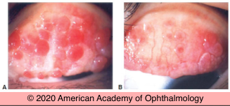
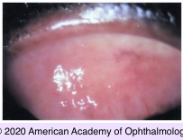
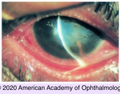
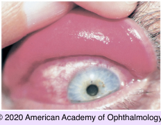

# Vernal/Atopic Conjunctivitis

## Images

## Hierarchy

- Case description
  - 10-year-old boy with bilateral eye itching and redness worse in spring and summer
  - Image Description
- Data acquistion
  - History
    - symptoms
      - ocular itching, irritation, redness, discharge
    - age
    - onset & course
      - seasonal variation
        - vernal KC
    - dermatitis
      - atopic KC
    - asthma
    - contact lens wear
    - trauma/surgery
      - giant papillary conjunctivitis
  - Physical Exam
    - thick ropy discharge
    - Horner-Trantas dots
    - SPK
    - filamentary keratopathy
    - shield ulcer
    - foreign body
- Assessment
  - VKC
    - young boy
    - itching
    - seasonal variation
    - giant papillary conjunctivitis
- Differential Diagnosis
  - vernal keratoconjunctivitis
    - children
      - giant papillae of upper tarsal conjunctiva
    - M>F
    - symptoms
      - itching
      - blepharospasm
      - photophobia
      - blurred vision
      - copious mucoid discharge
    - seasonal variation
      - year-round in tropical climates
    - giant papillae resembling cobblestones
    - complications
      - punctate epithelial erosions
        - superior and central cornea
      - noninfectious epithelial ulcers
        - oval or shieldlike
      - stem cell deficiency
        - pannus
      - keratoconus
  - atopic keratoconjunctivitis
    - similar to VKC with the following differences
      - older
      - minimal seasonal exacerbation
      - papillae occur in upper and lower palpebral conjunctiva
      - papillae are small or medium- sized
      - milky conjunctival edema + variable subepithelial fibrosis
      - extensive corneal vascularization and opacification (limbal stem cell dysfunction)
      - conjunctival scarring/ symblepharon formation
      - posterior subcapsular and/or anterior subcapsular cataract
      - corneal findings
        - punctate erosions
        - persistent epithelial defects
        - increased incidence of ectatic corneal diseases
        - increased incidence of staphylococcal and herpes simplex infections
          - depressed systemic cell- mediated immunity
  - giant papillary conjunctivitis
    - contact lens
    - prosthetic eye
    - foreign body
  - superior limbic keratoconjunctivitis
    - women 20–70 years of age
    - ocular findings
      - often bilateral
      - chronic, recurrent
      - superior corneal filamentary keratopathy
      - fine punctate fluorescein and rose bengal staining of superior cornea and superior bulbar conjunctiva
      - hypertrophy of superior limbus
      - injection and thickening of superior bulbar conjunctiva
      - fine papillary reaction of superior tarsal conjunctiva
  - floppy eyelid syndrome
    - obese
    - obstructive sleep apnea
    - clinical findings
      - small to large papillae on upper palpebral conjunctiva
      - mucus discharge
      - corneal involvement
        - mild punctate epitheliopathy
        - superior corneal filamentary keratopathy
      - ± unilateral
    - treatment
      - covering the affected eyes with a metal shield
      - taping the eyelids closed at night
      - surgical eyelid-tightening procedures
- Treatment
  - mild
    - cold compress
    - artificial tear
    - topical antihistamine
    - home air conditioning
    - relocate to cool environment if above rx not effective
  - mild-moderate
    - topical mast cell stabilizers
      - e.g. cromolyn
      - start at least 2 weeks before symptoms usually begin
      - continue rx for whole season
  - severe
    - steroid eye drops
      - for exacerbations with moderate to severe discomfort and/or decreased vision
    - topical cyclosporin
      - maximal effect takes several weeks
    - supratarsal injection of corticosteroid
    - oral cyclosporine for very severe cases
  - shield ulcer
    - topical steroid
    - topical antibiotic
    - topical cycloplegic
  - for atopic KC
    - oral antihistamine
    - systemic immune suppression
      - for severe cases
    - tacrolimus ointment for dermatitis
- Patient Education
  - Don’ts
    - avoid excessive eye rubbing
    - avoid contact lens wear when active
  - Course
    - seasonal variation
    - improvement with aging
  - follow-up
    - 1 week
    - daily for shield ulcer
    - monitor IOP if steroid use
