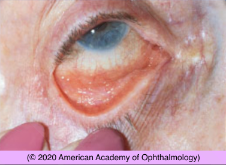

# Viral Conjunctivitis

## Images

## Hierarchy

- Case Description
  - young man complains of redness and watery discharge of both eyes for the past 2 days
  - Image Description
- Assessment
  - viral conjunctivitis
- Treatment
  - Medical
    - cool artificial tears
      - 4-8x/day
      - single use vial
        - True membrane: Pneumococcus Streptococcus Corynebacterium diphtheriae Herpes Ligneous conjunctivitis Chemical burn
      - preservative-free
    - cool compress
    - antihistamine drops
      - for itching
    - steroid drops
      - membranous/pseudo- membranous conjunctivitis
        - herpes —> true membrane
        - adenovirus—> pseudomembrane
      - severe subepithelial infiltrates
      - prolong infectious period
    - no antibiotic, unless
      - mucopurulent discharge
      - corneal abrasion
  - Surgical
    - remove membrane/ pseudomembrane
- Differential Diagnosis
  - viral conjunctivitis
    - adenovirus
      - most common
        - follicular conjunctival hypertrophy of the right eye
      - EKC
        - adenovirus 8,19,37
      - pharyngoconjunctival fever
        - adenovirus 3,7
      - adenovirus 11
    - herpes
    - acute hemorrhagic conjunctivitis
      - enterovirus 70
      - coxsackievirus A24
    - other viral syndromes
      - measles
      - mumps
      - influenza
  - chlamydia
  - molluscum contagiosum
    - no lymphadenopathy
  - toxic (medicamentosa)
  - pediculosis
- Patient Education
  - Dos
    - frequent hand washing
    - restrict work/school
    - avoid
      - touching eye
      - shaking hands
      - sharing towels/pillows/linens
  - Course
    - self-limited course
      - x 2-3 weeks
      - gets worse x first 4-7 days
    - contagious as long as
      - red eye
      - discharge/tearing
        - 10-12 days
  - Complications
    - SPK
    - corneal erosion
    - subepithelial infiltrates
    - membrane/pseudo- membrane
      - symblepharon
  - Follow-up
    - 2-3 weeks
      - sooner if
        - symptoms worsen
        - on topical steroids
- Data acquistion
  - History
    - medical history
      - upper respiratory infection
      - sick contacts
      - STD
        - chlamydia
    - ocular history
      - onset & course
      - unilateral vs bilateral
        - unilateral then bilateral suggests adenovirus
      - make-up sharing
      - excessive eyedrop use
  - Physical Exam
    - systemic
      - skin rash
      - preauricular adenopathy
        - herpes
        - adenovirus
          - cause acute follicular conjunctivitis
        - chlamydia
        - gonococcus
        - B. henselae
    - eyelid
      - umbilical lid lesions
      - lid vesicles
    - cornea
      - SPK
      - subepithelial infiltrates
      - corneal dendrites
- molluscum contagiosum
- Additional Testing
  - culture for chlamydia if persists >14 days
