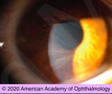

# Differential Diagnosis Vortex keratopathy (cornea verticillata)

## Images

## Hierarchy

- Case Description
  - asymptomatic middle-aged man with history of systemic hypertension and ventricular arrhythmia comes for routine eye examination
  - Image Description
    - bilateral whorl-like pattern of golden brown or gray deposits
- reduced vision with chloroquine family or tilorone hydrochloride
  - r/o retinal toxicity
- vortex keratopathy
  - etiology
    - medications
      - indomethacin
        - most common cause
          - reduced vision with amiodarone or tamoxifen
            - r/o optic neuropathy
      - amiodarone
        - anti-arrhythmic drug
      - chloroquine
        - hydroxychloroquine
          - .> (5) 6.5 mg/kg/day
        - chloroquine
          - .> (2.3) 3 mg/kg/day
      - phenothiazines
    - Fabry disease/carrier state
      - XLR
      - lysosomal storage disease
      - alpha galactosidase-A deficiency
      - conjunctival telangiectasia & vascular tortuosity
      - posterior spoke-like lens opacities
      - retinal telangiectasis & vascular tortuosity
      - refer to internist
        - neuropathic pain
        - kidney disease
        - angiokeratoma
  - clinical
    - inferior interpalpebral portion of the cornea
    - rarely result in reduction of vision or ocular symptoms
    - resolve with discontinuation of the responsible agents
  - healed corneal epithelial defect
  - dendritic keratopathy
- Additional Testing
  - if on chloroquine/ hydroxychloroquine
    - baseline and follow-up exams
      - r/o preexisting maculopathy
      - baseline
        - within 1 year
        - fundus examination
        - SD-OCT
        - VF
          - white target
          - 10-2
      - follow-up
        - annually (after 5 years of medication use)
        - SD-OCT
          - loss of IS-OS junction
          - flying saucer
        - VF
          - threshold VF (Humphrey 10-2)
            - white target
        - as needed or available
          - fundus autofluorescence
          - multifocal ERG
- Assessment
  - vortex keratopathy
    - patient on amiodarone for arrhythmia
      - unless develops maculopathy (chloroquine)
- Treatment
  - do not stop medication
- Patient Education
  - prognosis
    - benign
  - Complications
    - maculopathy
    - review medication dosage
      - toxic dosage
        - hydroxychloroquine
          - .>6.5 mg/kg/day
        - chloroquine
          - .>3 mg/kg/day
  - Follow-up
    - 1 year
      - monitor for maculopathy
- Data acquistion
  - History
    - medical history
      - medication use
    - ocular history
      - ocular symptoms
        - vortex keratopathy is asymptomatic
      - corneal abrasion
      - herpetic eye disease
  - Physical Exam
    - VA
    - laterality
      - vortex keratopathy is bilateral
    - herpetic eye disease
    - corneal abrasion
    - conjunctival telangiectasia & tortuosity
    - posterior spoke-like lens opacities
      - Fabry disease
    - retinal telangiectasis & tortuosity
    - bull’s eye maculopathy
      - chloroquine
